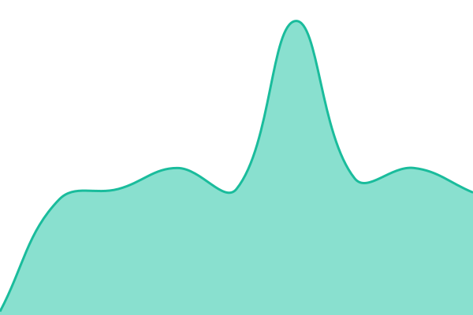

# [📈 Live Status](https://cityssm.github.io/upptime): <!--live status--> **🟧 Partial outage**

This repository contains the open-source uptime monitor and status page for [The Corporation of the City of Sault Ste. Marie](https://saultstemarie.ca/), powered by [Upptime](https://github.com/upptime/upptime).

With [Upptime](https://upptime.js.org), you can get your own unlimited and free uptime monitor and status page, powered entirely by a GitHub repository. We use [Issues](https://github.com/cityssm/upptime/issues) as incident reports, [Actions](https://github.com/cityssm/upptime/actions) as uptime monitors, and [Pages](https://cityssm.github.io/upptime) for the status page.

<!--start: status pages-->
<!-- This summary is generated by Upptime (https://github.com/upptime/upptime) -->
<!-- Do not edit this manually, your changes will be overwritten -->
<!-- prettier-ignore -->
| URL | Status | History | Response Time | Uptime |
| --- | ------ | ------- | ------------- | ------ |
|  [TCP Ping (WWW - 209.105.201.118)](209.105.201.118) | 🟥 Down | [tcp-ping-www-209-105-201-118.yml](https://github.com/cityssm/upptime/commits/HEAD/history/tcp-ping-www-209-105-201-118.yml) | 

 65ms
     
 | 

<a href="https://cityssm.github.io/upptime/history/tcp-ping-www-209-105-201-118">99.84%</a>
    

|  [TCP Ping (IP9 - 209.105.201.122)](209.105.201.122) | 🟥 Down | [tcp-ping-ip-9-209-105-201-122.yml](https://github.com/cityssm/upptime/commits/HEAD/history/tcp-ping-ip-9-209-105-201-122.yml) | 

 66ms
     
 | 

<a href="https://cityssm.github.io/upptime/history/tcp-ping-ip-9-209-105-201-122">99.88%</a>
    

|  [TCP Ping (IP13 - 209.105.201.126)](209.105.201.126) | 🟥 Down | [tcp-ping-ip-13-209-105-201-126.yml](https://github.com/cityssm/upptime/commits/HEAD/history/tcp-ping-ip-13-209-105-201-126.yml) | 

 65ms
     
 | 

<a href="https://cityssm.github.io/upptime/history/tcp-ping-ip-13-209-105-201-126">99.92%</a>
    

|  [SaultSteMarie.ca](https://saultstemarie.ca/) | 🟩 Up | [sault-ste-marie-ca.yml](https://github.com/cityssm/upptime/commits/HEAD/history/sault-ste-marie-ca.yml) | 

 418ms
     
 | 

<a href="https://cityssm.github.io/upptime/history/sault-ste-marie-ca">100.00%</a>
    

|  [Building Permit Services (apps.saultstemarie.ca)](https://apps.saultstemarie.ca/cityapps/) | 🟥 Down | [building-permit-services-apps-saultstemarie-ca.yml](https://github.com/cityssm/upptime/commits/HEAD/history/building-permit-services-apps-saultstemarie-ca.yml) | 

 381ms
     
 | 

<a href="https://cityssm.github.io/upptime/history/building-permit-services-apps-saultstemarie-ca">99.97%</a>
    

|  [Document Requesting Service (apps.saultstemarie.ca)](https://apps.saultstemarie.ca/cityapps/shop/products) | 🟩 Up | [document-requesting-service-apps-saultstemarie-ca.yml](https://github.com/cityssm/upptime/commits/HEAD/history/document-requesting-service-apps-saultstemarie-ca.yml) | 

 295ms
     
 | 

<a href="https://cityssm.github.io/upptime/history/document-requesting-service-apps-saultstemarie-ca">100.00%</a>
    

|  [Virtual City Hall (myfinance.saultstemarie.ca)](https://myfinance.saultstemarie.ca/vch/) | 🟩 Up | [virtual-city-hall-myfinance-saultstemarie-ca.yml](https://github.com/cityssm/upptime/commits/HEAD/history/virtual-city-hall-myfinance-saultstemarie-ca.yml) | 

 714ms
     
 | 

<a href="https://cityssm.github.io/upptime/history/virtual-city-hall-myfinance-saultstemarie-ca">100.00%</a>
    

<!--end: status pages-->

[**Visit our status website →**](https://cityssm.github.io/upptime)

## 📄 License

- Powered by: [Upptime](https://github.com/upptime/upptime)
- Code: [MIT](./LICENSE) © [The Corporation of the City of Sault Ste. Marie](https://saultstemarie.ca/)
- Data in the `./history` directory: [Open Database License](https://opendatacommons.org/licenses/odbl/1-0/)
